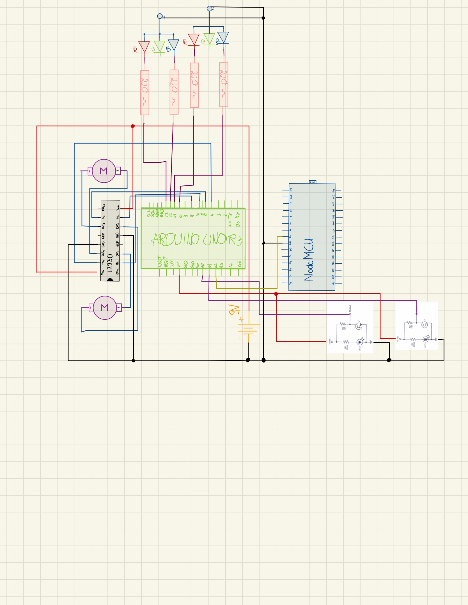
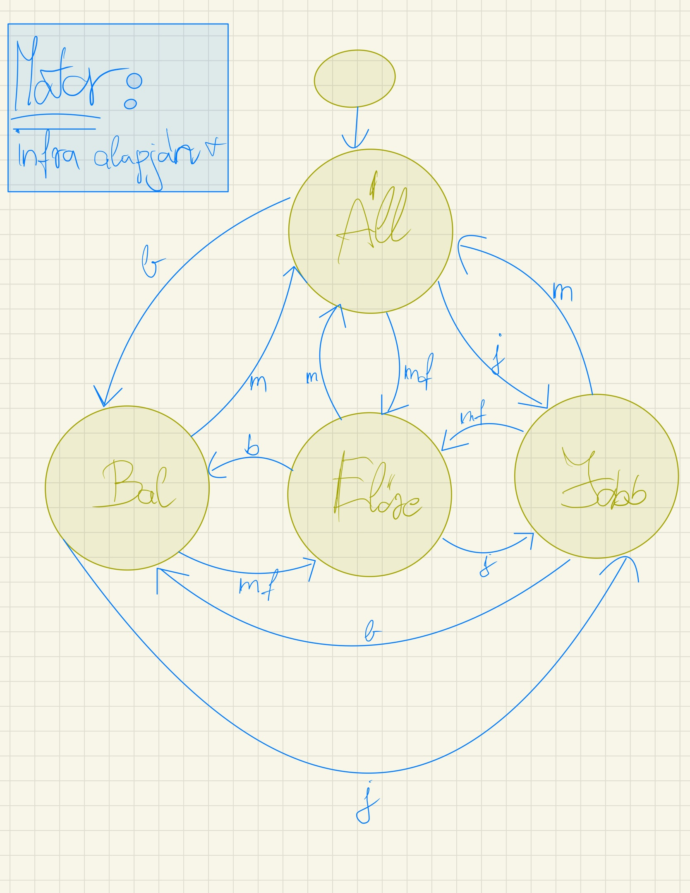
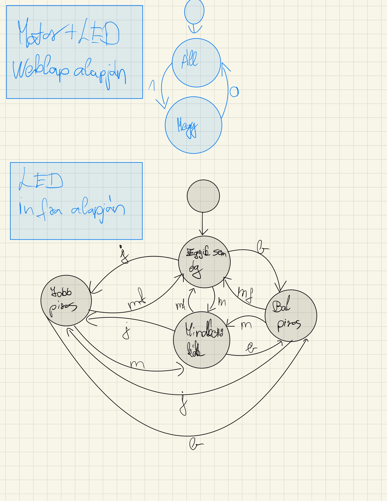

# Funkcionális specifikáció

## 1. Vágyálomrendszer leírása

A projektunk egy vonalkövet autó, ami egy vonalpálya  által definiált útvonalon közlekedik az általunk megadott helyre.
Ezt webes felületen keresztül lehet majd be és kikapcsolni. 
A mikrokontroller pedig egy NodeMCU és egy Arduino Uno.  

## 2. Alkatrész lista: 
1. Arduino Uno controller - 1db
2. NodeMCU-ESP-32S dual core WIFI modul - 1db
3. DC Motor 3V-6V, 1 tengelyes - 2 db
4. DC motor driver l293d - 1 db
5. OBS-IR, Infravörös akadály érzékelő modul - 2db
6. 9V-os elem - 1db
7. RGB LED -2 db
8. Piezzo - 1 db
9. Jumper Kábelek (FF, MM)
10. Ellenállás 220(ohm) - 6db
11. Lego (Váz, kerék)
12. 2 db kerék (DC motorhoz)

## 3. Használati esetek (működés)

* Webfelületen:
  * Terveink szerint itt lehet majd be és kikapcsolni  kis autónk.
  
* Szenzorok alapján:
  * A vonalpályát követve, infravörös szenzorok segítségével fog tájékozódni a kis autó.
  
## 4. Képernyőtervek (sematikus rajz és CAD tervrajz)

### 4.1: Sematikus rajz:

 
### 4.2: CAD tervrajz:

## 5. Forgatókönyvek (állapotátmenet gráf)

### 5.1: jelölések

#### 5.1.1 Állapotok jelölése:
- Infra :
  - j: jobb infra feketét érzékel 
  - b: jobb infra fehéret érzékel
  - m: mindkettő fehéret érzékel
  - mf: eggyik infra sem érzékel semmit

- Weblap gombjai alapján:
  - 0: kikapcsolt állapot
  - 1: bekapcsolt állapot
    
 ### 5.2 Állapotátmenet gráf:
 
 #### MOTOR:
 
 #### LED:
 
